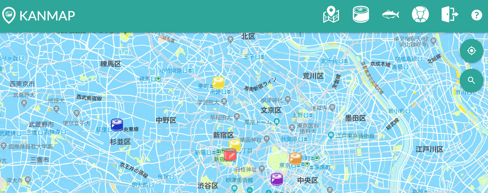
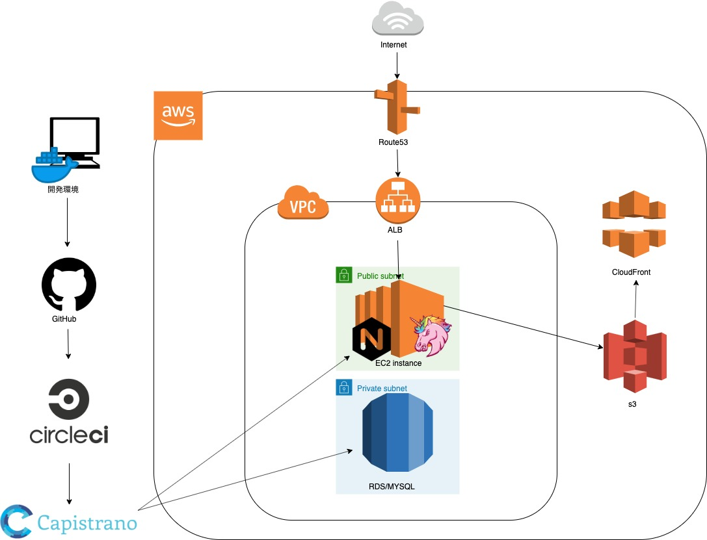

# KANMAP

 
## KANMAPとは

KANMAPは地図上のお気に入りの場所の情報を共有できるサービスです。 
転職活動用のポートフォリオとして制作致しました。 

## サイトページ
[KANMAP](https://kan-map.com)　 
トップ画面に登録不要で見れる閲覧用のテストユーザーログインボタンを用意しています。 

## 見ていただきたい部分
* インフラにAWSの各種サービスを活用しています。 
* Capistrano、CircleCIとGitHubを連携させて自動テスト、masterブランチのみ本番環境にデプロイ等、CI/CDのパイプラインを構築しています。
* 画像はS3に保存し、CloudFrontでCDN配信を行っています。 
 
## 使用技術
* Ruby 2.6.3 
* Ruby on Rails 5.2.3 
* MySQL 8.0.17 
* SASS 
* Materialize 
* AWS 
  * EC2/ALB 
  * RDS for MySQL 
  * S3 
  * CloudFront 
  * Route53 
  * ACM 
  * VPC 
  * CloudWatch 
  * AWS 
* Docker 
* CircleCI 
* Capistrano 
* Nginx 
* Unicorn 
* Google Maps Javascript API 
* Google Geocoding API 
* Google Places API 

## 機能一覧(使用gem)
* Rspecによる自動テスト機能
* Capistranoによるデプロイ機能
* CircleCIによるCI/CI機能
* Google、Twitterでの外部サービスログイン(omniauth) 
* 画像アップロード機能(carrierWave,rmagic,fog-aws) 
* 投稿機能CRUD 
* 記事一覧表示の際のページネーション機能(kaminari) 
* 検索機能(Ransack) 
* 管理ユーザー機能
* GoogleAPIを用いた現在地特定、キーワード検索、ジオコーディング機能 
 
## クラウドアーキテクチャ

 
## 開発環境
MacBookPro上のDocker環境で開発しています。 開発環境用イメージとそれらを起動するdocker-composeで構成されています。 docker-composeでVolumeをマウント、MySQLに関してもローカルのMySQLをマウントしています。 

## 改善点
* Dockerの導入は開発環境のみに留まっており、本番環境に導入できていない。ECSやBeanstalk等のコンテナ基盤の使用を課題としたい。
* 主にフロント周りにおいてコードの重複や無駄があり、十分なリファクタリングができていない。
* テストが一部しか書けていない。